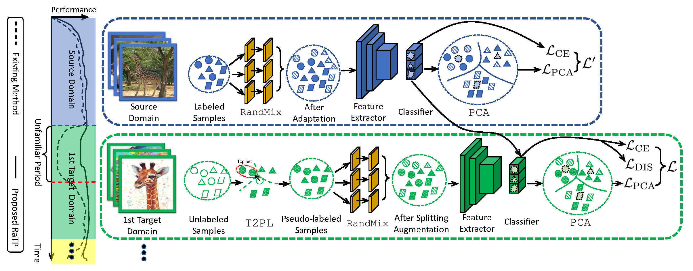

# Deja Vu: Continual Model Generalization for Unseen Domains  
Official Implementation for ICLR 2023 paper: [Deja Vu: Continual Model Generalization for Unseen Domains](https://arxiv.org/pdf/2301.10418.pdf)

  
RaTP first starts with a labeled source domain, applies RandMix on the full set of source data to generate augmentation data, and uses a simplified version of PCA for model optimization. Then, for continually arriving target domains, RaTP uses T2PL to generate pseudo labels for all unlabeled samples, applies RandMix on a top subset of these samples based on their softmax confidence, and optimizes the model by PCA.

# Dependencies:
pytorch==1.11.0  
torchvision==0.12.0  
numpy==1.20.3  
sklearn==0.24.2  

# Datasets
Download **Digit-Five** and **PACS** from https://github.com/jindongwang/transferlearning/tree/master/code/DeepDG. Rename them as `dg5` and `PACS` and place them in `./Dataset`.  
Download the subset of **DomainNet** used in our paper from https://drive.google.com/file/d/1LDnU3el-nHoqTgnvxEZP_PxdbdBapNKP/view?usp=sharing, and place it in `./Dataset`.  

# Usage
Run the files in `scripts`.

# Performance
The visualization of results will be saved in `result_*` after training.

# Citation
```
@article{liu2023deja,
  title={DEJA VU: Continual Model Generalization For Unseen Domains},
  author={Liu, Chenxi and Wang, Lixu and Lyu, Lingjuan and Sun, Chen and Wang, Xiao and Zhu, Qi},
  journal={arXiv preprint arXiv:2301.10418},
  year={2023}
}
```